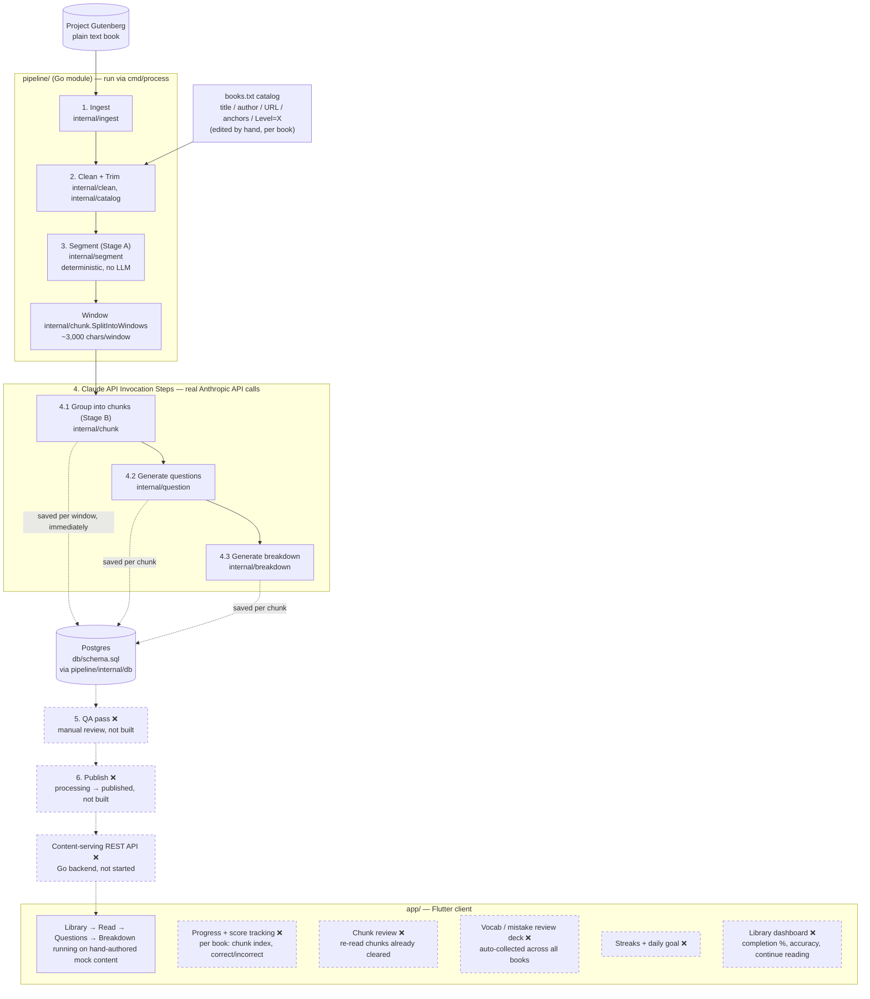

# Aidoku (愛読)

> **Working name.** "Aidoku" is already used by an existing manga-reading
> iOS app, so this name will change before any public release. Treat it as
> a placeholder throughout the codebase for now.

A language-learning app that teaches through literature: users read small,
sentence-safe chunks of real public-domain books unassisted, answer three
short questions per chunk (vocab / grammar / comprehension), then get a full
breakdown before moving on. v1 targets Japanese speakers learning English.

See [AIDOKU_DESIGN.md](./AIDOKU_DESIGN.md) for the full design plan.

## Architecture

What exists today, end to end, plus what's planned next — plain solid
boxes are built and have been run for real at least once; dashed boxes
marked ❌ are designed but not built yet:



Three separate `pipeline/cmd/*` binaries drive the pipeline side, not
just `cmd/process`: `cmd/ingest` (stops before the Claude API steps —
fetch/clean/trim/segment only, free to run), `cmd/livetest` (a
throwaway smoke test against a few hand-typed sentences, not a real
book), and `cmd/process` (the real end-to-end run, `-dry-run`-able,
diagrammed above). Only the user runs anything that invokes the real
Claude API — see the pipeline stage list above for which steps that
covers.

## Layout

- [`pipeline/`](./pipeline) — offline Go module implementing the content
  pipeline: ingest, clean (+ book catalog, trim), sentence segmentation,
  LLM chunk grouping, question generation, breakdown generation, and
  storage. `cmd/process` runs the whole thing end to end for a real book
  (`-dry-run` first to see real call counts and a rough cost estimate,
  with zero API calls made). See
  [AIDOKU_DESIGN.md §3](./AIDOKU_DESIGN.md) for the full stage-by-stage
  design and a per-stage build/test status table.
- [`app/`](./app) — Flutter client (macOS target so far). Currently a
  vertical-slice prototype of the full core loop (library → read →
  questions → breakdown) running on hand-authored mock content, not yet
  wired to the real pipeline.
- [`db/schema.sql`](./db/schema.sql) — the Postgres schema (books,
  chunks, questions, breakdowns, user progress), written to by
  [`pipeline/internal/db`](./pipeline/internal/db). See
  [AIDOKU_DESIGN.md §4/§6/§7f](./AIDOKU_DESIGN.md) for the data model,
  storage decision, and package, and [Development](#development) below
  to run Postgres locally.

A content-serving backend (Go) is not started yet — see
[Milestones](#milestones). The pipeline can persist its own output
(`pipeline/internal/db`), but nothing yet *serves* it back out to a
client — that's the backend's job once it exists.

## Development

Local Postgres, for keeping pipeline output (chunks, questions,
breakdowns) around between dev sessions instead of losing it every time a
script exits:

```sh
docker compose up -d
```

Schema is applied automatically the first time (a fresh named volume) —
see `db/schema.sql`. Data persists across restarts; `docker compose down
-v` is the only thing that discards it. Connection defaults live in
`.env` (`POSTGRES_*`), matching `docker-compose.yml`'s fallbacks — fine
to leave as-is for local dev.

## Milestones

**Completed**
- [x] Design plan drafted — [AIDOKU_DESIGN.md](./AIDOKU_DESIGN.md)
- [x] Pipeline: sentence segmentation (Stage A) — deterministic, no LLM; run against the real book
- [x] Pipeline: LLM chunk grouping (Stage B) and question generation (vocab/grammar/comprehension) — built, tested against fakes, and now run for real against the Claude API for the first time (small test batch, not a full book yet)
- [x] Pipeline: breakdown generation (`internal/breakdown`) — full Japanese explanation per chunk (sentence structure/vocab/grammar/meaning), matching the Flutter mock content's established house style; built and tested against fakes, wired into `cmd/livetest`, not yet run against the real Claude API
- [x] Pipeline: ingest, clean, book catalog, trim — run for real against Project Gutenberg; a real book (Pride and Prejudice) fully cleaned end to end, front/back matter and illustration placeholders handled
- [x] Book grading/leveling — manual, not a pipeline stage: assigned per book as a `Level=` line in `pipeline/books.txt`, parsed into a `ReadingLevel` enum by `internal/catalog`
- [x] Storage — Postgres schema (`db/schema.sql`) plus a Go package (`internal/db`) to write to it (upsert book/chunk/question, save breakdown); `cmd/livetest` now persists its real-API output through it, so pipeline results survive between dev sessions
- [x] Full pipeline orchestration (`cmd/process`) — runs ingest → Stage A → windowing (`chunk.SplitIntoWindows`) → Stage B → question gen → breakdown gen → `internal/db` for every book in the catalog, with per-chunk failure handling and a `-dry-run` mode; not yet run for real (`-dry-run` against The Vampyre: 17 windows, ~195 chunks, ~407 real API calls, ~$2.47 estimated)
- [x] Flutter app: mock vertical slice of the full core loop, verified running natively on macOS
- [x] Run `cmd/process` for real against The Vampyre — the full book, not just a test batch (estimated cost ~$5)

**Next up**
- [ ] Content-serving backend (Go) — nothing reads the database back out yet
- [ ] Wire real pipeline output into the Flutter app, replacing the hand-authored mock content
- [ ] Chapter boundary detection (deliberately deferred to the chunk-grouping stage — see design doc §7)
- [ ] Pick a real product name (see the working-name note above)
- [ ] Per-book progress + score tracking — current chunk index and correct/incorrect answer history per book (`UserProgress`, sketched in AIDOKU_DESIGN.md §4)
- [ ] Chunk review — let a user flick back through chunks they've already cleared in a book
- [ ] Personal vocab/mistake review deck — auto-collect words/grammar points answered incorrectly (or flagged) across *all* books into a standalone review list, not just chunk-level re-reading
- [ ] Streaks + daily goal — reading streak tracking and a daily-goal nudge (AIDOKU_DESIGN.md §5's gamification section named this as TBD; now has a concrete data trigger via `UserProgress`)
- [ ] Library dashboard — per-book completion % and accuracy, "continue reading" surfacing across the whole library

## Adding a Book to the Catalog

Books are added to [`pipeline/books.txt`](./pipeline/books.txt), one entry per book, entries separated by a blank line. Each entry is exactly six lines, in this order:

1. **Title** — exactly as shown to the user.
2. **Author** — exactly as shown to the user.
3. **Gutenberg URL — the plain text edition specifically.** On the book's Gutenberg page (`gutenberg.org/ebooks/<id>`), that's the "Plain Text UTF-8" download link, not the HTML, EPUB, or "-images" edition. The URL usually just ends in `.txt` — e.g. `.../cache/epub/<id>/pg<id>.txt` or `.../files/<id>/<id>-0.txt`. This matters, not just as a style preference: the pipeline's `Clean` step looks for Project Gutenberg's own `*** START/END OF ... PROJECT GUTENBERG EBOOK ***` markers, which only exist in the plain-text edition — anything else (HTML in particular) fails to parse.
4. **First line** of the actual novel content, verbatim — must match the cleaned text exactly once. Front matter (title pages, prefaces, tables of contents) before this line is trimmed away.
5. **Last line** of the actual novel content, verbatim — same rules. Back matter (colophons, "THE END" notices, ads) after this line is trimmed away.
6. **`Level=X`** — the book's assigned reading level, 1 (easiest) to 10 (hardest), assigned manually — see [Reading Levels](#reading-levels) below for what each number means.

A `# comment` line is ignored by the parser wherever it appears — useful for a section header, or for commenting out an entry, but no longer needed per-entry now that title/author are real fields.

`pipeline/books.txt`'s own header comment carries this same spec, kept in sync — `internal/catalog`'s tests parse the real file, so the two can't silently drift apart.

## Reading Levels

Each book is assigned a reading comprehension level manually, by me, corresponding to one of the ten levels below:

| # | Level Name | TOEIC Range | CEFR |
|---|------------|-------------|------|
| 1 | Initiate   | 10–120      | Pre-A1 |
| 2 | Novice     | 120–224     | A1 |
| 3 | Apprentice | 225–384     | A2 (low) |
| 4 | Reader     | 385–549     | A2 (high) |
| 5 | Bookworm   | 550–664     | B1 (low) |
| 6 | Erudite    | 665–784     | B1 (high) |
| 7 | Virtuoso   | 785–859     | B2 (low) |
| 8 | Luminary   | 860–944     | B2 (high) |
| 9 | Academic   | 945–965     | C1 (low) |
| 10 | Scholar   | 966–990     | C1 (high) |

Recorded as a `Level=` line in [`pipeline/books.txt`](./pipeline/books.txt), parsed into a `catalog.ReadingLevel` enum by `pipeline/internal/catalog` — not computed by the pipeline itself.

See [AIDOKU_DESIGN.md §3](./AIDOKU_DESIGN.md) for the detailed per-stage status table, and §7 for open design questions.
