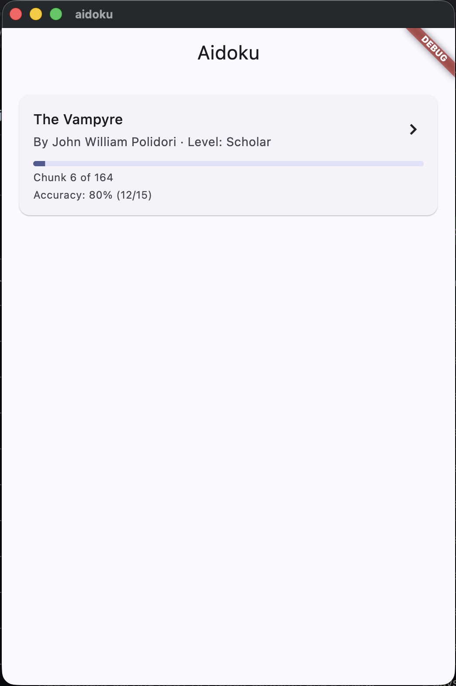
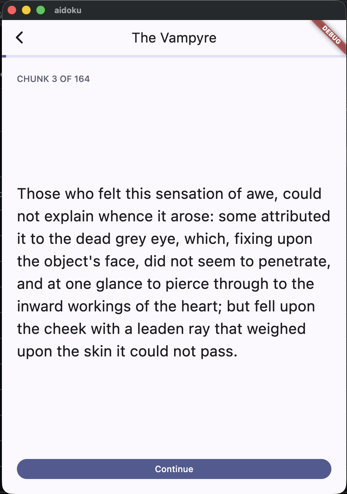
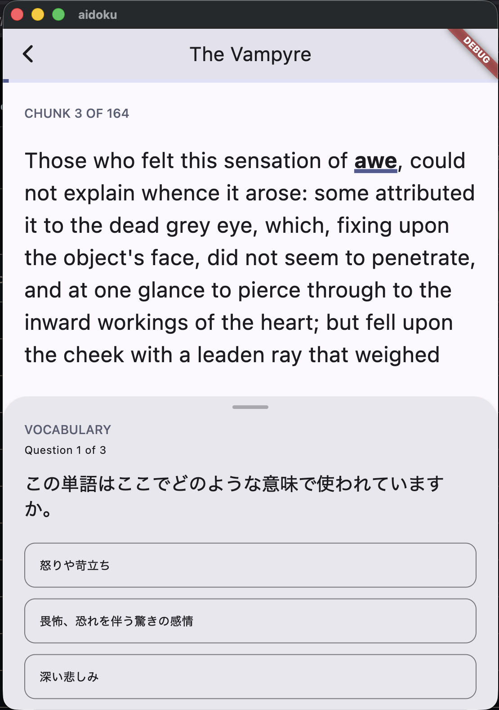
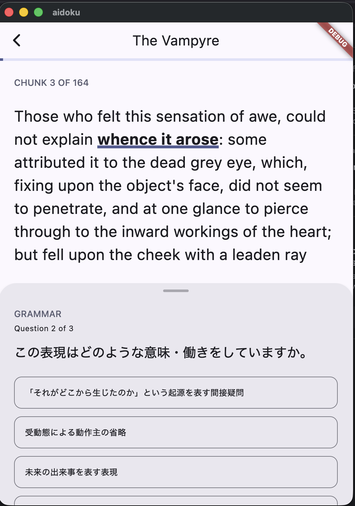
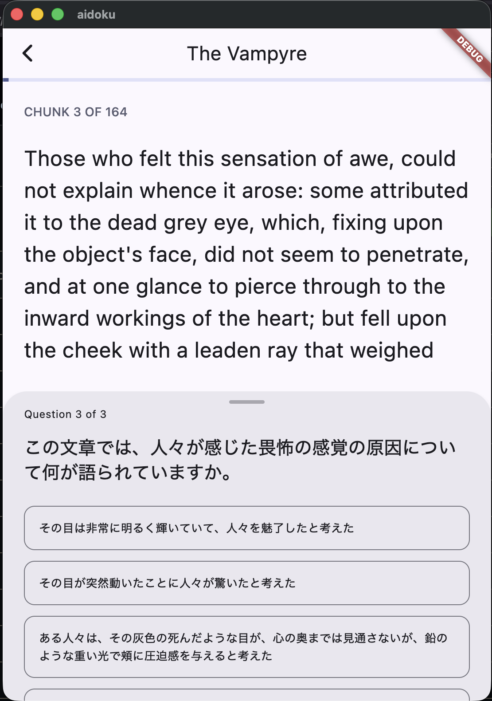
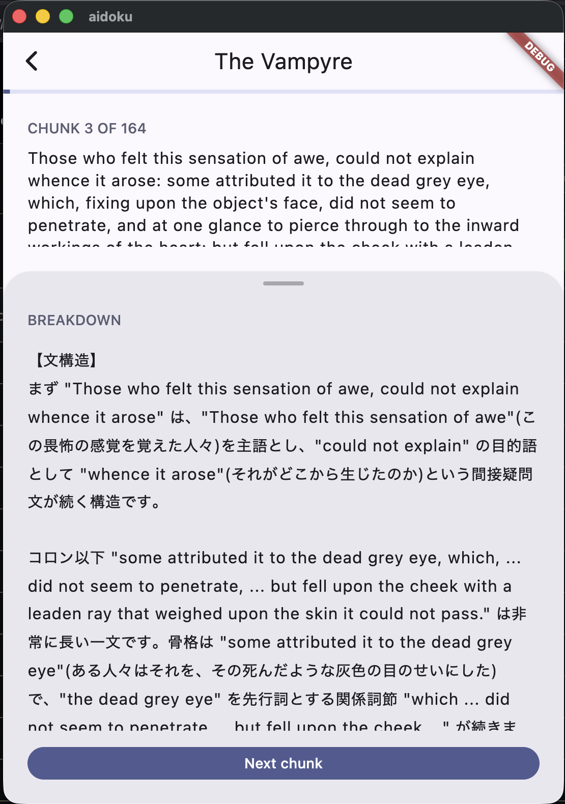
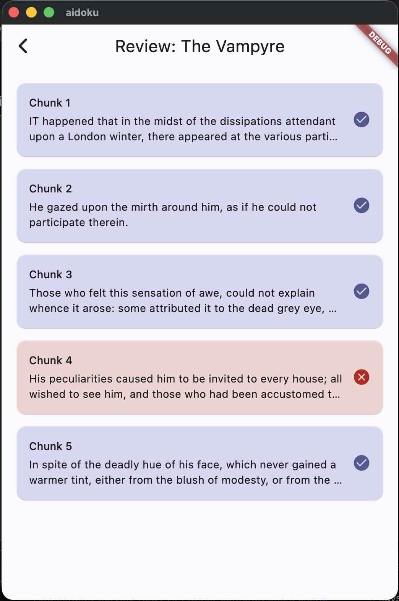
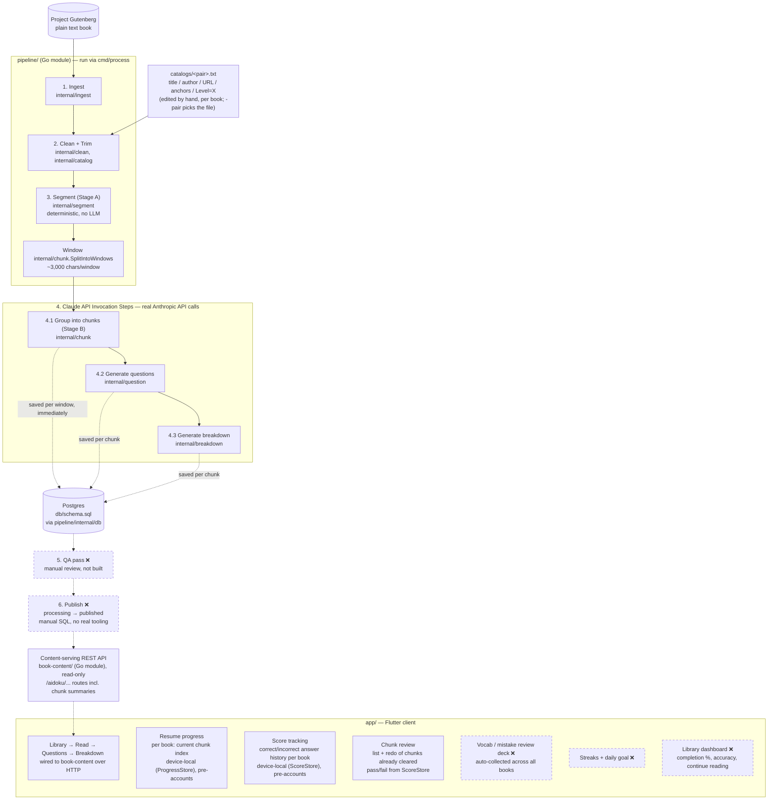

# Aidoku (愛読)

> **Working name.** "Aidoku" is already used by an existing manga-reading
> iOS app, so this name will change before any public release. Treat it as
> a placeholder throughout the codebase for now.

A language-learning app that teaches through literature: users read small,
sentence-safe chunks of real public-domain books unassisted, answer three
short questions per chunk (vocab / grammar / comprehension), then get a full
breakdown before moving on. v1 targets Japanese speakers learning English.

See [AIDOKU_DESIGN.md](./AIDOKU_DESIGN.md) for the full design plan.

## Screenshots

**Library**

**Reading**

**Vocab Question**

**Grammar Question**

**Comprehension Question**

**Full Breakdown**

**Review Screen**


(Screenshots taken on 15/08/2026)

## Architecture

What exists today, end to end, plus what's planned next — plain solid
boxes are built and have been run for real at least once; dashed boxes
marked ❌ are designed but not built yet:



Three separate `pipeline/cmd/*` binaries drive the pipeline side, not
just `cmd/process`: `cmd/ingest` (stops before the Claude API steps —
fetch/clean/trim/segment only, free to run), `cmd/livetest` (a
throwaway smoke test against a few hand-typed sentences, not a real
book), and `cmd/process` (the real end-to-end run, `-dry-run`-able,
diagrammed above). Only the user runs anything that invokes the real
Claude API — see the pipeline stage list above for which steps that
covers.

## Layout

- [`pipeline/`](./pipeline) — offline Go module implementing the content
  pipeline: ingest, clean (+ book catalog, trim), sentence segmentation,
  LLM chunk grouping, question generation, breakdown generation, and
  storage. `cmd/process` runs the whole thing end to end for a real book
  (`-dry-run` first to see real call counts and a rough cost estimate,
  with zero API calls made). See
  [AIDOKU_DESIGN.md §3](./AIDOKU_DESIGN.md) for the full stage-by-stage
  design and a per-stage build/test status table.
- [`book-content/`](./book-content) — the content-serving REST API, a separate Go
  module from `pipeline/`. Read-only: `internal/db` queries Postgres
  (filtered to published books only), `internal/api` serves it as JSON
  over the `/aidoku/...` routes, `cmd/server` is the entry point. Never
  calls the Claude API or writes anything.
- [`shared/`](./shared) — a third Go module holding only what
  `pipeline/` and `book-content/` need byte-for-byte identically: the
  Postgres connection plumbing (`dbconn`) and the `.env` loader
  (`dotenv`). Deliberately *not* home to the data model — `pipeline`'s
  write-shaped types and `book-content`'s read-shaped types stay separate on
  purpose, so the two modules aren't coupled by a shared schema
  representation. Tied together with `pipeline/` and `book-content/` via
  [`go.work`](./go.work) at the repo root for local development.
- [`app/`](./app) — Flutter client (macOS target so far). The full core
  loop (library → read → questions → breakdown) runs against real
  pipeline output via `book-content`, not mock content —
  `BookContentRepository` (`lib/data/`) talks to it over HTTP.
- [`db/schema.sql`](./db/schema.sql) — the Postgres schema (books,
  chunks, questions, breakdowns, user progress), written to by
  `pipeline/internal/db` and read by `book-content/internal/db`. See
  [AIDOKU_DESIGN.md §4/§6/§7f](./AIDOKU_DESIGN.md) for the data model
  and storage decision, and [Development](#development) below to run
  Postgres locally.

The pipeline persists its own output and the backend now serves it back
out over HTTP — see [Milestones](#milestones). Still missing: the
Flutter app isn't wired to the real backend yet, and stages 5/6
(QA pass, Publish) are still a manual `UPDATE book SET
status='published'`, not real tooling.

## Development

Local Postgres, plus the content-serving API (`book-content/`) reading from
it — one command brings both up, ready for the Flutter app to hit at
`http://localhost:8080/aidoku/...`:

```sh
docker compose up -d
```

Postgres's schema is applied automatically the first time (a fresh
named volume) — see `db/schema.sql`. Data persists across restarts;
`docker compose down -v` is the only thing that discards it. `book-content`
waits for Postgres's healthcheck before starting (`depends_on:
condition: service_healthy`). Connection defaults live in `.env`
(`POSTGRES_*`), matching `docker-compose.yml`'s fallbacks — fine to
leave as-is for local dev. After changing `book-content/`'s code, rebuild its
image with `docker compose up -d --build book-content`.

Only published books are served — see a book's `status` in
`db/schema.sql`. There's no Publish tooling yet (stage 6, still
manual), so during development that means running the one-off SQL
yourself, e.g. via `docker compose exec postgres psql -U aidoku -d
aidoku -c "UPDATE book SET status = 'published' WHERE gutenberg_id =
<id>;"`.

`pipeline/`, `book-content/`, and `shared/` are three separate Go modules,
tied together by [`go.work`](./go.work) at the repo root — run `go
build`/`go test`/`go vet` against all three at once from the repo root
with `./pipeline/... ./book-content/... ./shared/...` (a bare `./...` from the
root doesn't work, since the root itself isn't a module). For faster
iteration than a full container rebuild, run the API server directly
against the Dockerized Postgres:

```sh
go run ./book-content/cmd/server        # listens on :8080
```

## Milestones

**Completed**
- [x] Design plan drafted — [AIDOKU_DESIGN.md](./AIDOKU_DESIGN.md)
- [x] Pipeline: sentence segmentation (Stage A) — deterministic, no LLM; run against the real book
- [x] Pipeline: LLM chunk grouping (Stage B) and question generation (vocab/grammar/comprehension) — built, tested against fakes, and now run for real against the Claude API for the first time (small test batch, not a full book yet)
- [x] Pipeline: breakdown generation (`internal/breakdown`) — full Japanese explanation per chunk (sentence structure/vocab/grammar/meaning), matching the Flutter mock content's established house style; built and tested against fakes, wired into `cmd/livetest`, not yet run against the real Claude API
- [x] Pipeline: ingest, clean, book catalog, trim — run for real against Project Gutenberg; a real book (Pride and Prejudice) fully cleaned end to end, front/back matter and illustration placeholders handled
- [x] Book grading/leveling — manual, not a pipeline stage: assigned per book as a `Level=` line in its catalog file (`pipeline/catalogs/`), parsed into a `ReadingLevel` enum by `internal/catalog`
- [x] Storage — Postgres schema (`db/schema.sql`) plus a Go package (`internal/db`) to write to it (upsert book/chunk/question, save breakdown); `cmd/livetest` now persists its real-API output through it, so pipeline results survive between dev sessions
- [x] Full pipeline orchestration (`cmd/process`) — runs ingest → Stage A → windowing (`chunk.SplitIntoWindows`) → Stage B → question gen → breakdown gen → `internal/db` for every book in the catalog, with per-chunk failure handling and a `-dry-run` mode; not yet run for real (`-dry-run` against The Vampyre: 17 windows, ~195 chunks, ~407 real API calls, ~$2.47 estimated)
- [x] Flutter app: mock vertical slice of the full core loop, verified running natively on macOS
- [x] Run `cmd/process` for real against The Vampyre — the full book, not just a test batch (estimated cost ~$5)
- [x] Content-serving REST API (`book-content/`) — a separate Go module, read-only, serving book/chunk/question/breakdown as JSON over `/aidoku/...`, filtered to published books; connection plumbing shared with the pipeline via a third module (`shared/`) wired together with `go.work`. Smoke-tested end to end against the real Postgres data from The Vampyre (published manually via a one-off SQL update, since Publish tooling doesn't exist yet) — full book → chunk → question/breakdown chain, plus 404/400 error paths and graceful shutdown all verified against the running server.
- [x] `book-content` added to `docker-compose.yml` (`book-content/Dockerfile`, multi-stage, built from the repo root since it resolves `shared/` via `go.work`) — `docker compose up -d` now brings up Postgres and the API together, `book-content` waiting on Postgres's healthcheck; verified with a real `docker compose up -d` / container-to-container request over the compose network.
- [x] Flutter app wired to `book-content` (`BookContentRepository`, `lib/data/`) — the hand-authored mock content and `MockBookRepository` are gone; models flattened to match the API's response shapes exactly, chunk/question/breakdown fetched lazily per chunk (`LoadedChunk`) rather than all up front. Question answers shuffled on the app side. Widget tests rewired to a fake HTTP transport (`package:http`'s `MockClient`) instead of the removed mock repository, so they stay hermetic. Verified running natively on macOS end to end against the real Vampyre data — library → read → 3 questions → breakdown → next chunk. Added `com.apple.security.network.client` entitlement to both `Debug`/`Release.entitlements`.
- [x] Resume progress (`ProgressStore`/`LocalProgressStore`, `lib/data/`) — device-local for now (`shared_preferences`), deliberately behind an interface so an account-backed implementation can swap in later (see AIDOKU_DESIGN.md §4's `UserProgress` sketch) without `LibraryScreen`/`ReadingSessionScreen` changing. Saves the current chunk index on every chunk change, clears it once a book is finished, and falls back to the start on a stale/out-of-range saved index. Library cards show a real progress bar + "Chunk N of M" once a book has saved progress.
- [x] Score tracking (`ScoreStore`/`LocalScoreStore`, `lib/data/`) — correct/incorrect history per question, device-local for now (same pattern as `ProgressStore`, kept as a separate interface — see its doc comment). Surfaced as an accuracy percentage on library cards and a full correct/total tally on `CompleteView`.
- [x] Chunk review — an app bar icon on the reading screen opens a scrollable list of every cleared chunk, each row a teaser + a soft green/red tint and tick/cross icon for pass/fail, derived from `ScoreStore` — no new persistence needed. Tapping a row opens that chunk again — read → questions → breakdown, reusing `ChunkPanel` as-is. A chunk that was already fully correct opens *pre-answered* (every question shown already on its correct option, via `QuestionsView.startAnswered`); only a chunk with something wrong is a real interactive redo, which records to `ScoreStore` (overwriting the earlier attempt) same as before. Finishing one chunk auto-advances to the next reviewable one, same as the main flow, and returns to the list once there's nothing further to review. New backend endpoint proivides per chunk — previews, truncated server-side to the first sentence.
- [x] I18N — the pipeline supports multiple language pairs (EN_JP and JP_EN so far), and the Flutter app now has a Settings screen for choosing native/study language, filtering the Library to match. Run for real end to end: a full Japanese book processed and published, and selectable from the app.

**Next up**
- [ ] Chapter boundary detection (deliberately deferred to the chunk-grouping stage — see design doc §7)
- [ ] Pick a real product name (see the working-name note above)
- [ ] Personal vocab/mistake review deck — auto-collect words/grammar points answered incorrectly (or flagged) across *all* books into a standalone review list, not just chunk-level re-reading
- [ ] Streaks + daily goal — reading streak tracking and a daily-goal nudge (AIDOKU_DESIGN.md §5's gamification section named this as TBD; now has a concrete data trigger via `UserProgress`)
- [ ] Library dashboard — a dedicated overview screen aggregating what's currently only shown per-card (completion %, accuracy — see Score tracking/Resume progress above), plus "continue reading" surfacing across the whole library

## Adding a Book to the Catalog

Books are added to a catalog file under [`pipeline/catalogs/`](./pipeline/catalogs) — one file per language pair (see [AIDOKU_DESIGN.md §7i](./AIDOKU_DESIGN.md)): [`EN_JP.txt`](./pipeline/catalogs/EN_JP.txt) for English source books with Japanese explanations, [`JP_EN.txt`](./pipeline/catalogs/JP_EN.txt) for the reverse. `cmd/process`'s `-pair` flag picks which one a run reads — there's no default. Within a file, one entry per book, entries separated by a blank line. Each entry is exactly six lines, in this order:

1. **Title** — exactly as shown to the user.
2. **Author** — exactly as shown to the user.
3. **Gutenberg URL — the plain text edition specifically.** On the book's Gutenberg page (`gutenberg.org/ebooks/<id>`), that's the "Plain Text UTF-8" download link, not the HTML, EPUB, or "-images" edition. The URL usually just ends in `.txt` — e.g. `.../cache/epub/<id>/pg<id>.txt` or `.../files/<id>/<id>-0.txt`. This matters, not just as a style preference: the pipeline's `Clean` step looks for Project Gutenberg's own `*** START/END OF ... PROJECT GUTENBERG EBOOK ***` markers, which only exist in the plain-text edition — anything else (HTML in particular) fails to parse.
4. **First line** of the actual novel content, verbatim — must match the cleaned text exactly once. Front matter (title pages, prefaces, tables of contents) before this line is trimmed away.
5. **Last line** of the actual novel content, verbatim — same rules. Back matter (colophons, "THE END" notices, ads) after this line is trimmed away.
6. **`Level=X`** — the book's assigned reading level, 1 (easiest) to 10 (hardest), assigned manually — see [Reading Levels](#reading-levels) below for what each number means.

A `# comment` line is ignored by the parser wherever it appears — useful for a section header, or for commenting out an entry, but no longer needed per-entry now that title/author are real fields.

Each catalog file's own header comment carries this same spec, kept in sync — `internal/catalog`'s tests parse the real `EN_JP.txt` file, so the two can't silently drift apart.

## Reading Levels

Each book is assigned a reading comprehension level manually, by me, corresponding to one of the ten levels below:

| # | Level Name | CEFR      |
|---|------------|-----------|
| 1 | Initiate   | Pre-A1    |
| 2 | Novice     | A1        |
| 3 | Apprentice | A2 (low)  |
| 4 | Reader     | A2 (high) |
| 5 | Bookworm   | B1 (low)  |
| 6 | Erudite    | B1 (high) |
| 7 | Virtuoso   | B2 (low)  |
| 8 | Luminary   | B2 (high) |
| 9 | Academic   | C1 (low)  |
| 10 | Scholar   | C1 (high) |

Recorded as a `Level=` line in a catalog file (see [`pipeline/catalogs/`](./pipeline/catalogs)), parsed into a `catalog.ReadingLevel` enum by `pipeline/internal/catalog` — not computed by the pipeline itself.

See [AIDOKU_DESIGN.md §3](./AIDOKU_DESIGN.md) for the detailed per-stage status table, and §7 for open design questions.
